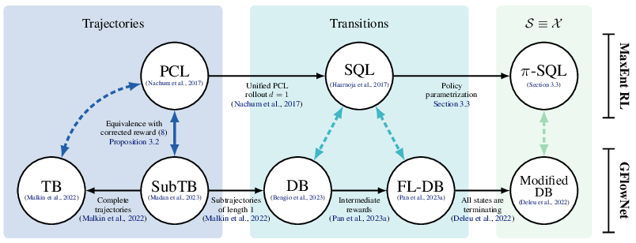

# GFlowNets & Maximum Entropy RL

<div align="center">
    </img>
</div>

This repository contains the official code in [JAX](https://github.com/google/jax) for a comparison between GFlowNets and Maximum Entropy RL algorithms, based on ([Deleu et al., 2024](https://arxiv.org/abs/2402.10309)).

> Tristan Deleu, Padideh Nouri, Nikolay Malkin, Doina Precup, Yoshua Bengio. *Discrete Probabilistic Inference as Control in Multi-path Environments*. 2024.

## Installation
Follow the [instructions](https://github.com/google/jax/#installation) on the official repository in order to install JAX. Then you can install the additional dependencies with:
```bash
pip install -r requirements.txt
```

## Example
You can train a GFlowNet using the Forward-Looking Detailed Balance loss ([Pan et al., 2023](https://arxiv.org/abs/2302.01687)) on the factor-graph inference environment of [Buesing et al., 2020](https://arxiv.org/abs/1910.06862).
```bash
python train.py algorithm=fldb env=treesample
```
For other algorithms and environments, see the configuration files in the [`config/`](config) folder.

## Citation
If you want to cite this paper, use the following Bibtex entry:
```
@article{deleu2024gfnmaxentrl,
    title={{Discrete Probabilistic Inference as Control in Multi-path Environments}},
    author={Deleu, Tristan and Nouri, Padideh and Malkin, Nikolay and Precup, Doina and Bengio, Yoshua},
    journal={arXiv preprint},
    year={2024}
}
```
